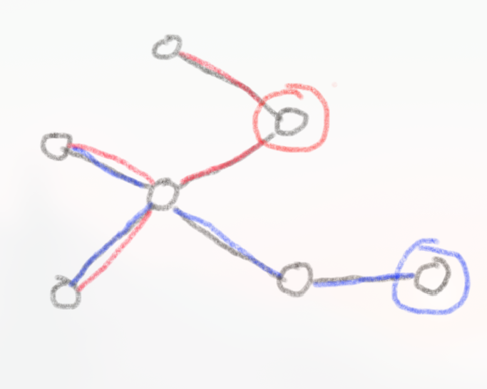
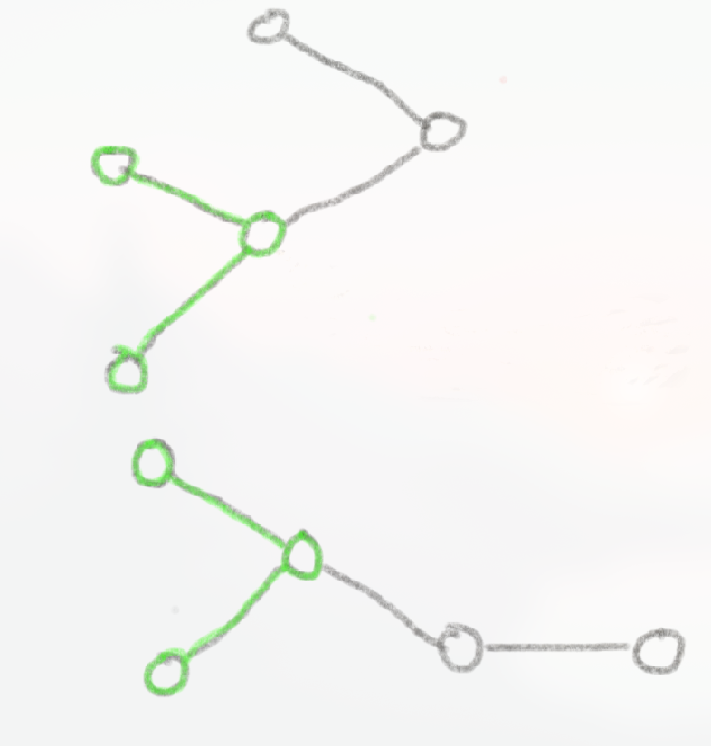

# .req files
The requirements for a build can be expressed entirely within a `.req` file.  The instructions on how to solve one with this tool is in `python/main.py`.

An example for a bladeharper deepspindle build:
```
# I am a comment
// i am also a comment?!
Free:
40 str
perseverance := 30 wll, 30 ftd
30 int
30 str, 35 ftd
15 ftd, 40 wll

Post:
perseverance => 90 ftd
80 sdw
(lht + med + hvy = 90r or 75r med), (25 agl or 25 str)
```

Requirements in the `Free` section can be obtained anywhere in the progression (i.e. talents, mantras), while requirements in the `Post` section must be obtained after using the shrine of order. There's a few reasons why one might want specific requirements in `Post`. Take the case where you want level 5 gale mantras <=> `80r WND` must be satisfied. If you satisfy this pre-shrine and then use the shrine to reduce gale, your mantra levels will be reduced accordingly. Thus, mantra level requirements must be fulfilled post-shrine.

You may also give requirements identifiers with the following syntax:
```
perseverance := 30 wll, 30 ftd
^^^ assigns 30 wll, 30 ftd to the variable 'perseverance'
```

This is optional, but required if you want to express that a requirement is a _prerequisite_ of another, which is done later in the file:
```
perseverance => 90 ftd
^^^ perseverance is a requirement for reinforced armor (90 ftd)

// To give it a name at the same time, this also works:
perseverance => reinforced_armor := 90 ftd
```

Alternatively, you can name both requirements and write a prereq assertion later:
```
Free:
perseverance := 30 wll, 30 ftd
...

Post:
ra := 90 ftd
...

# It doesn't matter if this assertion is in Post or Free, as long as the identifiers present
# are defined in the right section.
perseverance => ra
```

For asserting multiple prereqs:
```
Free:
perseverance := 30 wll, 30 ftd
battle_tendency := 15 wll, 15 ftd
...

Post:
ra := 90 ftd
...

perseverance, battle_tendency => ra
```

If you have a req that doesn't have any stat requirement, but requires prereqs, create an empty named requirement:
```
Free:
scrapsinger := 35 mtl
crystal := 40 ice
surge := 40 ltn

# empty requirement!
golden_age := ()

scrapsinger, crystal, surge => golden_age
```

## Optional requirements

An optional requirement is one that is not required to be obtained, but can be obtained as a part of an optimization objective.

```
Free:
# specify a weight for the optional req, from 1-20.
5; exoskeleton := 40 ftd

neural_overload := 85 int
...
```

**Note:** Making *any prereq* of a required req optional is invalid. To model optional reqs with prereqs, simply make the req itself optional:
```
p1 := ...
p2 := ...
p3 := ...

1; has_alot_of_prereqs := 42 hvy

p1, p2, p3 => has_alot_of_prereqs

# this works also!
1; p1, p2, p3 => 42 hvy
```

This recursively marks all prereqs as optional, with their obtainment being directly tied to the optional dependents'. That is, `p1, p2, p3` and any of *their* prereqs are now obtained **if and only if** `has_alot_of_prereqs` is obtained. We group all of these 'linked' requirements together into an **optional group**. 

If you still want to acquire a prereq regardless of whether the dependent is chosen, use a special directive to re-mark a prereq as required:

```
p1 := ...
# must acquire p2 now!
+ p2 := ...
p3 := ...

1; has_alot_of_prereqs := 42 hvy

p1, p2, p3 => has_alot_of_prereqs
```

Naturally, if `p2` has any prereqs, they will recursively be marked as required again. This moves `p2` and it's reqs out of the optional group it was in prior. 

Suppose in more complex cases, two or more requirements are marked as optional but share the same prerequisite. In the figure below, two requirements are marked as optional, circled red and blue, with their prerequisites to the left. The prerequisite subtrees are colored with their corresponding optional req's color.   



In this case, the shared requirements will be duplicated into different trees.



Then each tree itself forms an optional group. 

Optional requirements are only attempted to be acquired if there is an optimization objective that requires them (e.g. your objective is to maximize the total weight of optional requirements).
